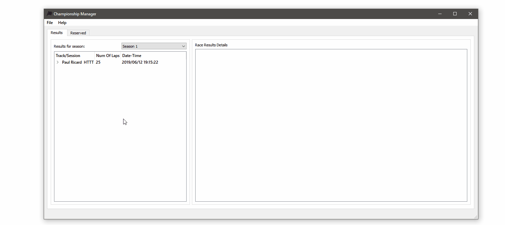

# Championship Manager

# Project is currently on hold for an unforeseeable future

[](https://ci.appveyor.com/project/Helther/champmanager/branch/master)
[](https://travis-ci.org/Helther/ChampManager)


Championship Manager is a cross platform desktop application for accessing log files, which have been created after participating in a race weekend by a rFactor 2 api.
After adding logs to Championship Manager, they get proccessed and stored in SQLite database instance for later viewing via the results tab.


_Screenshot of results tab of main window_
## Features
The list of included features so far:
 * adding race logs in a weekend format (grouping)
 * adding race logs to separate seasons
 * navigating race list in a gui view filtered by a season
 * inspecting detailed info of a selected race session via details view
 * all actions are syncronized with the database
## Usage

Results tab includes races list on the left and details view on the right, which is accessible by selecting a session on the left.



_Navigating the results tab_ 

Adding new races or adding/deleting seasons is done by accessing main menu 


_Adding new results and viewing the changes_
## Dependencies
1. A C++ compiler that supports C++17.
The following compilers should work:

  * [gcc 7+](https://gcc.gnu.org/)

  * [clang 6+](https://clang.llvm.org/)

2. [CMake 3.12+](https://cmake.org/)

3. [Qt 5.14.1+(Qt5Widgets, Qt5Gui, Qt5Core, Qt5Sql)](https://www.qt.io/)

### Build
Target platforms are Windows and Linux. You can build main target via CMake
From build directory:
```
 $ cmake -DCMAKE_BUILD_TYPE=%TypeName% -DCMAKE_PREFIX_PATH=%QTDIR% -G "%Generator name%" .
 $ cmake --build . --target ChampManager
```
Specifying for example either "MinGW Makefiles" for Windows or "Unix Makefiles" for Linux with Qt installation directory, and a desired build type. 
Or use qmake with .pro file, but to run the tests you need to CMake

## Testing
For testing was used CMake's ctest [ctest docs](https://cmake.org/cmake/help/latest/manual/ctest.1.html). So far there is one unit test, for the file parser.
### Building the tests
ctests are build via CMake by specifying test target.
```
 $ cmake --build . --target test_parser
```

### Running the tests
To run built tests
```
 $ ctest -C Debug
```

## Versioning

0.1 - added file parsing capabilities

0.2 - added and integrated gui for results viewing

### Future plans

 * add user profile with championship settings and statistics
 * add gui for viewing/add/editing championship participants
 * add championship progression after every new race and season with periodic updates to teams and drivers

## License

This project is licensed under the GNU GPLv2 License - see the [LICENSE.md](LICENSE.md) file for details.
Some third party files are subjective to their respective license.
